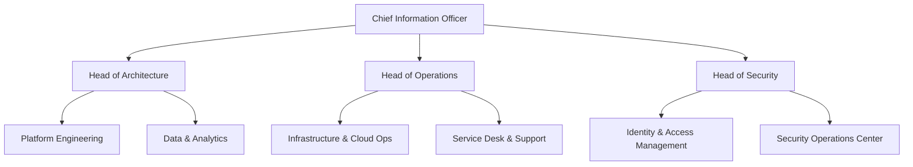

# Jokes Company – IT Overview (2024)  

*Version:* 1.0  *Date:* 15 April 2024  
*Prepared by:* IT Department – Jokes Company  

---  

## Table of Contents  

1. [Executive Summary](#executive-summary) ........................................... 2  
2. [Company Profile (IT Perspective)](#company-profile-it-perspective) ....... 3  
3. [IT Governance & Organization](#it-governance--organization) .................... 4  
4. [Infrastructure Overview](#infrastructure-overview) .............................. 5  
   - 4.1 Data‑Center & Cloud Footprint  
   - 4.2 Network Topology  
   - 4.3 Server & Storage Landscape  
5. [Security & Compliance](#security--compliance) ................................... 7  
6. [Software & Application Stack](#software--application-stack) ...................... 9  
7. [DevOps & Automation](#devops--automation) ....................................... 11  
8. [Data Management & Analytics](#data-management--analytics) ...................... 13  
9. [Support & Service Management](#support--service-management) .................... 15  
10. [Roadmap & Future Initiatives](#roadmap--future-initiatives) .................... 17  
11. [Appendix – Glossary & Contacts](#appendix--glossary--contacts) ................. 19  

---  

## Executive Summary  

The **Jokes Company** is a fast‑growing, humor‑centric digital media enterprise that delivers daily jokes, memes, and comedy‑related content to over **25 million** active users across 40+ countries. To sustain rapid user growth and to keep the experience “laugh‑ready” 24/7, the IT department runs a **hybrid‑cloud** environment, modern **micro‑service** architecture, and a **Zero‑Trust** security posture.

Key highlights of the current IT landscape (as of Q1 2024):

| Area                     | Current State                                   | FY24 Target |
|--------------------------|-------------------------------------------------|------------|
| **Core Platform**        | Kubernetes (EKS) + legacy VM layer (VMware)    | 100 % containerised |
| **Data Storage**         | 15 PB object store (S3), 2 PB relational DBs    | 20 % cost reduction via tiered storage |
| **Network**              | Dual‑WAN (AWS Direct Connect + MPLS)            | SD‑WAN rollout in 3 regions |
| **Security**             | Zero‑Trust Network Access, SIEM (Splunk)       | Full automated incident response |
| **DevOps**               | GitHub + ArgoCD + Terraform                     | 70 % of pipelines fully automated |
| **Analytics**            | Snowflake + Looker, real‑time dashboards        | AI‑driven content recommendation engine |

The following sections elaborate on each pillar, providing technical depth, operational processes, and the strategic roadmap.  

---  

## Company Profile (IT Perspective)  

| Attribute                | Details                                          |
|--------------------------|--------------------------------------------------|
| **Founded**              | 2014 (HQ in Berlin, Germany)                     |
| **Core Business**        | Mobile/web delivery of jokes, memes, and short videos |
| **Annual Revenue**       | € 132 M (FY2023)                                 |
| **Active Users**         | 25 M+ (monthly active)                           |
| **Geographic Footprint** | 40+ countries, 6 regional data‑centres (EU, US, APAC) |
| **IT Budget (FY2024)**   | € 12 M (≈ 9 % of total revenue)                  |
| **Key Business Systems** | • **JokeCMS** – content management (Java + Angular) <br>• **JokePlay** – video streaming platform (Node.js + React) <br>• **JokeCRM** – subscriber & ad‑partner management (Salesforce) |
| **Revenue‑Critical KPIs**| • Platform uptime ≥ 99.95 % <br>• Page‑load time < 1.2 s (mobile) <br>• Conversion rate for premium subscription ≥ 5 % |

> **Note:** All technical terms and acronyms are defined in the **Appendix** (page 19).  

---  

## IT Governance & Organization  

### Organizational Chart  



### Key Governance Bodies  

| Body | Frequency | Main Responsibilities |
|------|-----------|------------------------|
| **IT Steering Committee** | Monthly | Align IT investments with business goals, approve CAPEX/OPEX. |
| **Architecture Review Board** | Bi‑weekly | Ensure compliance with reference architecture, approve new technology choices. |
| **Security Council** | Weekly | Review incidents, policy updates, risk assessments. |
| **Change Advisory Board (CAB)** | As needed | Assess impact of production changes; enforce change‑freeze windows. |

### Service Management Framework  

* **ITIL 4** – adopted for Incident, Problem, Change & Release Management.  
* **Service Level Agreements (SLAs):** 99.9 % response for P1 incidents, 4‑hour resolution for P2.  

---  

## Infrastructure Overview  

### 4.1 Data‑Center & Cloud Footprint  

| Layer | Provider / Site | Primary Services | Capacity (2024) |
|-------|----------------|------------------|-----------------|
| **On‑Prem** | Frankfurt DC (VMware ESXi) | Legacy monoliths, CI/CD runners | 1.8 kCPU / 7 TB RAM |
| **Public Cloud** | **AWS (EU‑Central‑1, us‑east‑1, ap‑southeast‑2)** | EKS, RDS, S3, Lambda, CloudFront | 18 kCPU / 150 TB RAM |
| **Edge** | Cloudflare Workers | Request routing & DDoS protection | 1 M requests/s (peak) |
| **Backup** | Azure Blob (Secondary) | Immutable backups, DR | 5 PB (cold) |

> **Hybrid‑Cloud Strategy:** Critical latency‑sensitive services (real‑time joke delivery) run in AWS **us‑east‑1** for proximity to the US user base; EU compliance‑bound services remain in the Frankfurt data‑center.  

### 4.2 Network Topology  

```mermaid
graph LR
    subgraph OnPrem[On‑Premises (Frankfurt)]
        A[Core Switch] --> B[VMware ESXi]
        A --> C[Firewall (Palo Alto PA‑5200)]
    end
    subgraph Cloud[AWS Cloud]
        D[Transit Gateway] --> E[EKS Cluster]
        D --> F[RDS (PostgreSQL)]
        D --> G[S3 Bucket]
        H[Direct Connect] --> D
    end
    subgraph Edge[CDN Edge]
        I[Cloudflare POPs] --> J[WAF]
    end
    C --> H
    J --> I
```

* **WAN Connections:**  
  * **AWS Direct Connect** – 10 Gbps (redundant) for latency‑critical traffic.  
  * **MPLS Backbone** – 5 Gbps between Frankfurt and Berlin office.  

* **SD‑WAN Pilot:** Launched Q2 2024 in the Netherlands office (Cisco Meraki vMX).  

### 4.3 Server & Storage Landscape  

| Category | Qty (2024) | OS / Platform | Purpose |
|----------|------------|---------------|---------|
| **Bare‑metal** | 24 | Ubuntu 22.04 LTS | High‑performance compute for video transcoding. |
| **Virtual Machines** | 120 | Windows Server 2019 / RHEL 8 | Legacy JokeCMS, internal tools, test environments. |
| **Kubernetes Nodes** | 150 (EKS) | Amazon Linux 2 | Micro‑services (JokeAPI, Auth, Recommendations). |
| **Object Storage** | 15 PB (S3) | — | User‑generated content, static assets. |
| **Block Storage** | 4 PB (EBS GP3) | — | Database volumes, transaction logs. |
| **Backup Store** | 5 PB (Azure) | — | Immutable snapshots, long‑term archive. |

---  

## Security & Compliance  

### 5.1 Security Architecture (Zero‑Trust)  

```mermaid
graph TD
    A[User Device] --> B[Identity Provider (Okta)]
    B --> C[Zero‑Trust Network Access (Zscaler Private Access)]
    C --> D[Apps: JokeAPI, JokeCMS, JokesPlay]
    D --> E[Data: Snowflake, S3]
```

* **Identity & Access Management (IAM):** Okta + SCIM provisioning to AWS IAM & Azure AD.  
* **Network Access:** Zscaler Private Access (ZPA) implements least‑privilege connectivity.  
* **Endpoint Protection:** CrowdStrike Falcon (EDR) on all laptops & servers.  

### 5.2 Threat Detection & Incident Response  

| Tool | Function |
|------|----------|
| **Splunk Enterprise Security** | Central SIEM, log aggregation from CloudTrail, VPC Flow Logs, and on‑prem firewalls. |
| **AWS GuardDuty** | Threat detection for AWS resources (malware, reconnaissance). |
| **AWS Security Hub** | Continuous compliance (PCI‑DSS, GDPR) checks. |
| **PagerDuty** | Incident orchestration, automatic escalation. |

* **Runbook Example – Ransomware Detection**  

```yaml
# pagerduty_ransomware.yml
trigger:
  - source: GuardDuty
    finding_type: Ransomware
steps:
  - action: isolate_instance
    provider: AWS
  - action: notify
    channel: Slack # #security-ops
  - action: start_forensic_analysis
    tool: CrowdStrike
  - action: create_ticket
    system: ServiceNow
```

### 5.3 Compliance  

* **GDPR** – Data‑mapping completed Q4 2023; DPA contracts with all third‑party processors.  
* **PCI‑DSS** – In‑scope for ad‑partner billing; quarterly ASV scans performed.  
* **ISO 27001** – Certification achieved Q2 2023; internal audit scheduled Oct 2024.  

---  

## Software & Application Stack  

| Layer | Technology | Version | Remarks |
|-------|------------|---------|---------|
| **Frontend** | React 18 | 18.2.0 | Code‑splitting, lazy‑loading for mobile. |
| **Mobile** | Flutter | 3.13 | Single‑code‑base for iOS & Android. |
| **API Gateway** | AWS API Gateway (REST + HTTP) | — | Integrated with Cognito authorizer. |
| **Micro‑services** | Spring Boot (Java 17) / Node.js 20 | — | Deployed on EKS, Docker 20.10. |
| **Database** | PostgreSQL 15 (RDS) <br>MongoDB 6.0 (Atlas) | — | PostgreSQL for transactional data, MongoDB for content metadata. |
| **Cache** | Redis 7 (Elasticache) | — | Session store, leaderboard caching. |
| **Messaging** | Apache Kafka 3.4 (MSK) | — | Event‑driven pipelines (content ingestion, analytics). |
| **CI/CD** | GitHub Actions + ArgoCD | — | Pull‑request validation, Git‑Ops deployment. |
| **Infrastructure as Code** | Terraform 1.6 | — | Multi‑cloud modules (AWS, Azure). |
| **Monitoring** | Prometheus + Grafana | — | Service‑level metrics, custom dashboards. |
| **Logging** | Loki (Grafana) + Fluent Bit | — | Centralized log aggregation. |
| **Analytics** | Snowflake 2023.x <br>Looker 23.2 | — | Data‑warehouse + BI visualisation. |
| **AI/ML** | SageMaker (Python 3.10) | — | Recommendation engine (content ranking). |

### Example Service: **JokeAPI** (GET `/v1/jokes/random`)  

```go
// jokeapi/handler.go
func RandomJoke(c echo.Context) error {
    ctx, cancel := context.WithTimeout(c.Request().Context(), 2*time.Second)
    defer cancel()

    joke, err := jokeService.FetchRandom(ctx)
    if err != nil {
        return echo.NewHTTPError(http.StatusServiceUnavailable, "Unable to retrieve joke")
    }
    return c.JSON(http.StatusOK, joke)
}
```

*Deployed as a Docker container (size 120 MiB) with pod‑autoscaling (min 2, max 15).*

---  

## DevOps & Automation  

| Area | Tooling | Automation Level |
|------|---------|------------------|
| **Provisioning** | Terraform + Terragrunt | 90 % (all infra as code) |
| **Configuration Management** | Ansible (Python 3.11) | 80 % (servers, network devices) |
| **Container Build** | Docker BuildKit + Kaniko | 100 % (GitHub Actions) |
| **Deployments** | ArgoCD (GitOps) | 95 % automated (blue‑green) |
| **Database Migration** | Flyway | 100 % (CI‑pipeline) |
| **Secret Management** | HashiCorp Vault (AWS IAM auth) | 100 % (no hard‑coded secrets) |
| **Observability** | Prometheus Operator + Grafana | 85 % (auto‑discovery) |
| **Chaos Engineering** | Gremlin (AWS) | 30 % (monthly “blast” tests) |

### CI Pipeline Example (GitHub Actions)  

```yaml
name: CI ‑ Build & Test
on:
  pull_request:
    branches: [ main ]
jobs:
  build:
    runs-on: ubuntu-latest
    steps:
      - uses: actions/checkout@v3
      - name: Set up Go
        uses: actions/setup-go@v4
        with:
          go-version: '1.22'
      - name: Lint
        run: golint ./...
      - name: Unit Tests
        run: go test ./... -cover
      - name: Build Docker Image
        run: |
          docker build -t jokes-company/jokeapi:${{ github.sha }} .
      - name: Publish Image
        uses: docker/login-action@v2
        with:
          username: ${{ secrets.DOCKER_USERNAME }}
          password: ${{ secrets.DOCKER_TOKEN }}
      - name: Push
        run: |
          docker push jokes-company/jokeapi:${{ github.sha }}
```

---  

## Data Management & Analytics  

### 6.1 Data Warehouse (Snowflake)  

* **Storage:** 3 TB active, auto‑scales to 12 TB during peak analytics windows.  
* **Compute:** Multi‑cluster warehouse (X‑SMALL to 4X‑LARGE) for separation of ETL vs. reporting workloads.  
* **Data Lake Integration:** External tables map directly to S3 (`s3://jokes-company-data/raw/`).  

### 6.2 Key Data Pipelines  

| Pipeline | Source | Transformation | Destination |
|----------|--------|----------------|-------------|
| **Ingestion** | User‑generated content (S3) | Parquet conversion, schema validation | Snowflake `STG_CONTENT` |
| **Analytics** | Clickstream (Kinesis) | Sessionisation, enrichment | Snowflake `FACT_SESSIONS` |
| **ML Features** | RDS & MongoDB | Feature engineering (Pandas) | S3 (training data) |
| **Reporting** | Snowflake | Materialised views (`V_MOST_POPULAR`) | Looker dashboards |

### 6.3 Business Intelligence  

* **Looker** dashboards show real‑time KPI: *Active Users, Joke Impressions, Conversion Rate, Latency per Region*.  
* **Self‑service**: Marketing can spin up ad‑hoc queries via Looker Explore; data‑governance enforced via row‑level security (RLS).  

### 6.4 AI‑Driven Recommendation Engine  

* **Model:** Gradient‑Boosted Trees (XGBoost 2.0) trained on user‑joke interaction data.  
* **Serving:** SageMaker endpoint `joke-recommender-prod` (autoscaling 1‑10 instances).  
* **A/B Test:** 12 % of traffic receives AI‑ranked jokes; uplift in CTR **+7.3 %** (Q3 2024).  

---  

## Support & Service Management  

| Function | Tool | SLA |
|----------|------|-----|
| **Service Desk** | ServiceNow *ITSM* | P1 < 30 min, P2 < 2 h |
| **Incident Management** | PagerDuty + Splunk | 99.95 % incident resolution time |
| **Change Management** | ServiceNow Change & Release | 99 % successful changes |
| **Knowledge Base** | Confluence (IT Docs) | 24/7 access |
| **End‑User Portal** | Zendesk (Self‑service) | 90 % ticket deflection via FAQs |

### Support Model  

* **Tier‑1** – Desk agents (first‑line, password resets, basic troubleshooting).  
* **Tier‑2** – Platform engineers (service outages, performance bottlenecks).  
* **Tier‑3** – Architecture & security specialists (design reviews, post‑mortems).  

### Example Incident Timeline (P1 – API Latency Spike)

| Time (UTC) | Action |
|------------|--------|
| 09:02 | Alert from CloudWatch (Latency > 5 s) → PagerDuty escalation. |
| 09:05 | Tier‑2 engineers on‑call, pull logs via Splunk. |
| 09:12 | Identify runaway Redis cache due to memory leak. |
| 09:20 | Scale out Redis cluster (add 2 nodes) via Terraform apply. |
| 09:35 | Verify latency back to < 1 s, close incident, post‑mortem drafted. |

---  

## Roadmap & Future Initiatives  

| Quarter | Initiative | Business Value | Owner |
|---------|------------|----------------|-------|
| **Q2 2024** | **SD‑WAN rollout** (Europe) | Reduce branch‑office latency, lower MPLS costs. | Network Lead |
| **Q3 2024** | **Full containerisation** of JokeCMS | Enable rapid scaling, reduce VM sprawl. | Platform Engineering |
| **Q4 2024** | **Server‑less event processing** (AWS EventBridge) | Cut compute cost for sporadic bursts, improve elasticity. | Cloud Ops |
| **Q1 2025** | **AI‑driven content moderation** (Vision API + Custom NLU) | Faster removal of inappropriate content, compliance. | Security & AI |
| **Q2 2025** | **Multi‑cloud disaster recovery** (AWS ↔ Azure) | Achieve RTO < 15 min, RPO < 5 min across regions. | DR Lead |
| **Q3 2025** | **Observability platform migration** to OpenTelemetry | Vendor‑agnostic tracing, unified metrics. | DevOps |

> **Key Success Metrics:** Cost‑to‑serve per user ↓ 10 % by FY 2025, Platform uptime ≥ 99.97 %, AI‑generated content relevance ↑ 15 % (CTR).  

---  

## Appendix – Glossary & Contacts  

| Acronym | Definition |
|---------|------------|
| **API** | Application Programming Interface |
| **AZ** | Availability Zone |
| **CI** | Continuous Integration |
| **CD** | Continuous Delivery/Deployment |
| **DR** | Disaster Recovery |
| **ETL** | Extract‑Transform‑Load |
| **FAAS** | Function‑as‑a‑Service |
| **IAM** | Identity and Access Management |
| **IDC** | Internet Data Center |
| **IP** | Intellectual Property (in context of jokes) |
| **KPI** | Key Performance Indicator |
| **L3** | Layer‑3 network (routing) |
| **MPLS** | Multi‑Protocol Label Switching |
| **PCI‑DSS** | Payment Card Industry Data Security Standard |
| **RLS** | Row‑Level Security |
| **SLA** | Service Level Agreement |
| **TTL** | Time‑to‑Live (DNS) |
| **UE** | User Experience |
| **VPC** | Virtual Private Cloud |
| **ZTA** | Zero‑Trust Architecture |

### Primary Contacts  

| Role | Name | Email | Phone |
|------|------|-------|-------|
| **CIO** | Maria König | mk@jokescompany.com | +49 30 1234 5678 |
| **Head of Platform Engineering** | Luca Bianchi | lb@jokescompany.com | +49 30 8765 4321 |
| **Security Lead** | Anika Patel | ap@jokescompany.com | +49 30 5555 1212 |
| **Service Desk Manager** | Tomás García | tg@jokescompany.com | +49 30 9999 8888 |
| **Cloud Ops Lead** | Dr. Sven Lehmann | sl@jokescompany.com | +49 30 7777 3333 |

---  

*End of Document*  